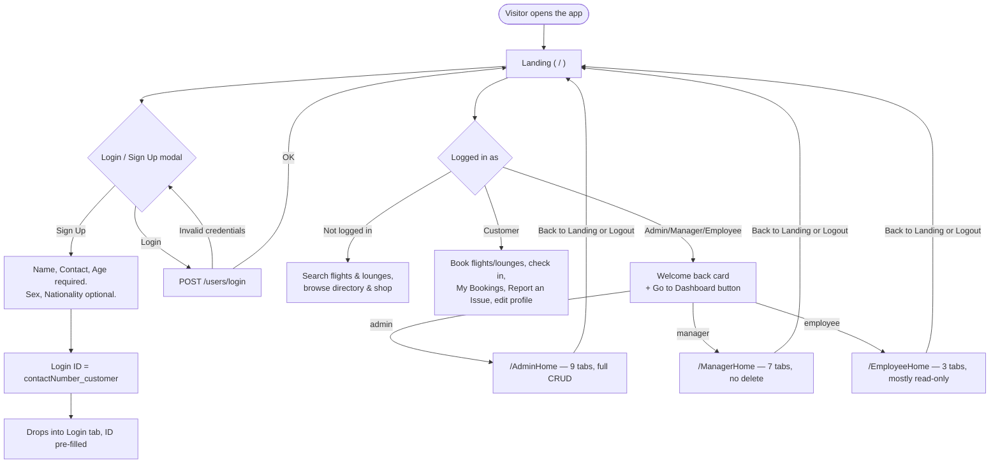
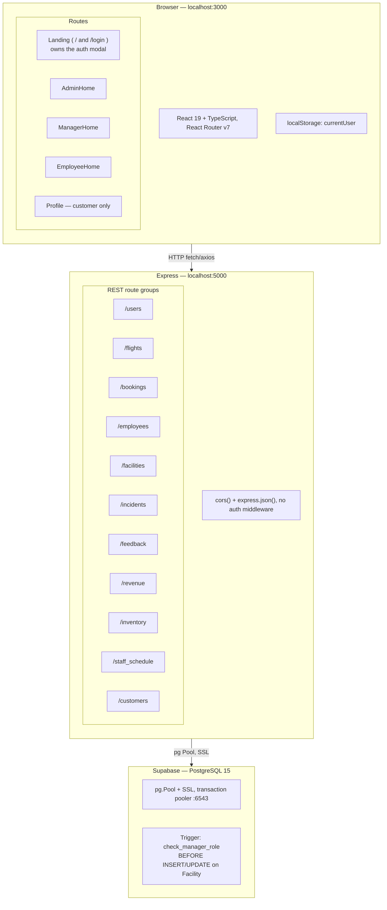

# Airport Management System (AMS)

A full-stack web application for managing airport facilities, staff, bookings, flights,
revenue, incidents, and feedback. Built with TypeScript across the entire stack.

For what each role can actually do day to day, see the **[users/](users/)** folder —
[Admin](users/admin.md), [Manager](users/manager.md), [Employee](users/employee.md),
[Customer](users/customer.md). This file covers the technical shape of the system; those
cover the human-facing flow.

## Tech Stack

| Layer | Technology |
|---|---|
| Frontend | React 19, TypeScript, React Router v7, react-icons |
| Backend | Node.js, Express 4, TypeScript, ts-node-dev |
| Database | PostgreSQL 15 (hosted on Supabase, via the transaction pooler) |
| DB Driver | node-postgres (`pg`) with SSL |
| Auth | Client-side only — `localStorage.currentUser`, no server sessions or JWT |

---

## User Flow

Landing (`/`) is the single entry point and home for **every** role, not just customers.
Login and Signup are a modal that opens over Landing — there's no separate login page to
navigate away to and back from. After logging in, everyone lands back on Landing: customers
get booking/check-in/report-issue widgets right there, staff get a "Welcome back" card with
a button into their own dashboard (a separate route, since dense CRUD tables don't fit a
scrolling consumer page).



A logged-in user who lands on the wrong dashboard URL (e.g. a customer hitting
`/AdminHome` directly) is bounced back to Landing, not to a login page — Landing is always
the fallback.

---

## System Architecture



Access control is entirely client-side: `RequireAuth` checks `currentUser.role` from
`localStorage` before rendering a route, and that's the only gate. The backend has **no**
auth middleware, session, or token check anywhere — every route trusts its caller. That's a
deliberate scope choice for this project (see `RestructuringPlans/Auth.md`), not an
oversight, but it means the API itself is not safe to expose beyond this trusted setup.

---

## Database Schema

12 tables. `Customer` and `Employee` both use surrogate serial IDs — there's no Aadhaar
column anywhere in the current schema (removed; see `RestructuringPlans/Schema.md`).

```mermaid
erDiagram
    Employee {
        int Employee_Id PK
        varchar Name
        varchar Role "22-value CHECK list"
        varchar Department "5-value CHECK list, nullable"
        varchar Shift_Timings
    }
    Facility {
        int Facility_Id PK
        varchar Name
        varchar Type "Gym/Lounge/Restaurant/Shop/Other"
        text Location
        text Description
        varchar Contact_No
        varchar Opening_Hours
        int Manager_Id FK "must be Role=Manager, trigger-enforced"
    }
    Customer {
        int Customer_Id PK
        varchar Customer_Name
        int Age "NOT NULL"
        varchar Sex "nullable"
        varchar Nationality "nullable"
        varchar Contact_No "UNIQUE"
    }
    Flight {
        int Flight_Id PK
        varchar Flight_Number
        varchar Airline
        varchar Origin
        varchar Destination
        timestamp Departure_Time
        timestamp Arrival_Time
        varchar Status
        varchar Gate
        varchar Terminal
    }
    Booking {
        int Booking_Id PK
        int Facility_Id FK "exclusive-or with Flight_Id"
        int Flight_Id FK "exclusive-or with Facility_Id"
        int Customer_Id FK
        int Employee_Id FK "nullable: null = self-service booking"
        timestamp Date_Time
        varchar Payment_Status
        boolean Checked_In
    }
    Feedback {
        int Feedback_Id PK
        int Facility_Id FK
        int Customer_Id FK
        int Manager_Id FK
        timestamp Date_Time
        int Rating "1-5"
        text Comments
    }
    Revenue {
        int Revenue_Id PK
        int Facility_Id FK
        int Financial_Year
        date Month
        numeric Monthly_Revenue
        numeric Yearly_Revenue
    }
    Inventory {
        int Inventory_Id PK
        int Facility_Id FK
        varchar Item_Name
        int Quantity
        numeric Price
        varchar Supplier
    }
    Staff_Schedule {
        int Schedule_Id PK
        int Employee_Id FK
        int Facility_Id FK
        date Shift_Date
        time Shift_Start
        time Shift_End
        text Task_Description
        timestamp Created_At
    }
    Communication {
        int Message_Id PK
        int Sender_Id FK
        int Receiver_Id FK
        varchar Message_Type
        text Message
        timestamp Sent_At
    }
    Incident {
        int Incident_Id PK
        int Reported_By FK "exclusive-or with Reported_By_Customer_Id"
        int Reported_By_Customer_Id FK "exclusive-or with Reported_By"
        int Facility_Id FK
        int Assigned_To FK "defaults to facility's manager if unset"
        text Description
        varchar Status
        timestamp Reported_At
        timestamp Resolved_At
    }
    users {
        int id PK
        varchar name
        varchar contact_number
        int customer_id FK "nullable"
        int employee_id FK "nullable"
        varchar role "admin/manager/employee/customer"
        varchar password "bcrypt hash"
        varchar login_id UK
    }

    Employee ||--o{ Facility : manages
    Employee ||--o{ Booking : "assists (nullable)"
    Employee ||--o{ Feedback : manages
    Employee ||--o{ Staff_Schedule : "scheduled in"
    Employee ||--o{ Communication : "sends/receives"
    Employee ||--o{ Incident : "reports or is assigned"
    Facility ||--o{ Booking : has
    Facility ||--o{ Feedback : receives
    Facility ||--o{ Revenue : generates
    Facility ||--o{ Inventory : holds
    Facility ||--o{ Staff_Schedule : hosts
    Facility ||--o{ Incident : "site of"
    Customer ||--o{ Booking : makes
    Customer ||--o{ Feedback : gives
    Customer ||--o{ Incident : reports
    Customer ||--o{ users : "linked login (nullable)"
    Employee ||--o{ users : "linked login (nullable)"
```



`Booking` and `Incident` each use an exclusive-arc pattern (a DB `CHECK` constraint, not
just app-level validation) — a Booking is for a Facility *or* a Flight, never both or
neither; an Incident is reported by an Employee *or* a Customer, same rule.

Migrations live in `database/migrations/`, applied in order via `backend/scripts/migrate.js`
(`0001_baseline.sql` is a destructive one-time reset; everything after it is additive).

---

## Project Structure

```
DBMS_Project/
├── .env                          # DATABASE_URL + PORT (not committed)
├── users/                        # Per-role user-flow docs — keep in sync with any UI/flow change
│   ├── admin.md
│   ├── manager.md
│   ├── employee.md
│   └── customer.md
├── database/
│   └── migrations/                # 0001_baseline.sql, then additive 000N_*.sql files
├── backend/
│   └── src/
│       ├── db.ts                  # single pg Pool, import from here
│       ├── index.ts                # Express app (port 5000), all routes mounted here
│       └── routes/                # users, flights, bookings, employees, facilities,
│                                    # incidents, feedback, revenue, inventory, staff_schedule, customers
├── frontend/
│   └── src/
│       ├── App.tsx                 # route table
│       ├── config/airport.ts       # deployment branding (name, labels, copy)
│       ├── styles/ds.ts            # shared inline style system + useIsMobile — Landing's
│       │                           # tokens (colors/landing/blob) AND the dashboards' shared
│       │                           # tokens (dash.*) both live here
│       ├── index.css               # shared CSS classes used by every admin_tab/* component
│       ├── components/
│       │   ├── LoginSignUp.tsx     # the auth modal — rendered by Landing, not routed to
│       │   ├── RequireAuth.tsx     # client-side role guard
│       │   ├── AdminHome.tsx / ManagerHome.tsx / EmployeeHome.tsx   # dashboard shells
│       │   ├── admin_tab/          # 9 tabs, all full CRUD except Revenue (read-only)
│       │   ├── landing/            # customer-facing sections rendered inline on Landing
│       │   └── customer_tab/       # Profile.tsx
│       └── pages/
│           ├── Landing.tsx         # universal home for every role
│           └── SearchFlights.tsx
```

---

## Setup

### Prerequisites
- Node.js 18+
- A Supabase project (or local PostgreSQL)

### 1. Environment
Create `.env` in the project root:
```env
DATABASE_URL=postgresql://postgres.<project-ref>:<password>@aws-<region>.pooler.supabase.com:6543/postgres
PORT=5000
```
Use the **transaction pooler** host (port 6543), not the direct `db.<ref>.supabase.co:5432`
host — the direct host is IPv6-only in most regions and will hang on many networks. See
`RestructuringPlans/DatabaseConnectivity.md` for the full story.

### 2. Database
```bash
cd backend && npm run migrate
```
Applies every file in `database/migrations/` in order. Then seed test accounts:
```
database/seed_users.sql
```
(run directly in the Supabase SQL editor, or via your usual `psql` client).

### 3. Backend
```bash
cd backend && npm install && npm run dev
```

### 4. Frontend
```bash
cd frontend && npm install && npm start
```

---

## Test Credentials

| Role | Login ID | Password |
|---|---|---|
| Admin | `9000000001_admin` | `admin123` |
| Manager | `9000000002_manager` | `manager123` |
| Employee | `9000000003_employee` | `employee123` |
| Customer | `9000000004_customer` | `customer123` |

> **Note:** On a university/institutional network, port 6543 may still be blocked — a
> mobile hotspot is the fastest workaround (see `RestructuringPlans/DatabaseConnectivity.md`).

---

## API Endpoints

Base URL: `http://localhost:5000`. All mutation params are passed as URL query strings
(not a JSON request body), except `POST /users` (signup) and `POST /users/provision-staff`,
which take a JSON body.

### `/users`
| Method | Path | Description |
|---|---|---|
| GET | `/users?loginId=` | Fetch a user by login ID (no password in the response) |
| POST | `/login` | Verify credentials, return the user record |
| POST | `/users` | Sign up — creates a Customer row + a users row together |
| PUT | `/users?loginId=` | Edit your own profile — requires `currentPassword` |
| POST | `/users/provision-staff` | Admin-only: creates an Employee row + login together, requires the calling admin's own password |

### `/flights`
| Method | Path | Description |
|---|---|---|
| GET | `/flights/search` | Filter by flight_number, airline, departure_date |
| POST | `/flights/create` | Create |
| PUT | `/flights/update` | Update |
| DELETE | `/flights/:flight_number` | Delete (path param, not query string) |

### `/bookings`
| Method | Path | Description |
|---|---|---|
| GET | `/bookings/search` | Filter by booking_id, facility_id, customer_id, employee_id, payment_status |
| GET | `/bookings/summary` | Joined view with facility + customer + employee names |
| POST | `/bookings/create` | Create |
| PUT | `/bookings/update` | Update any field |
| PUT | `/bookings/checkin` | Mark a flight booking checked in |
| DELETE | `/bookings/delete` | Delete |

### `/facilities`
| Method | Path | Description |
|---|---|---|
| GET | `/facilities/search` | Filter by facility_id, name, type, location, manager_id |
| GET | `/facilities/top-rated` | Facilities with avg rating > 4 |
| POST | `/facilities/insert` | Create |
| PUT | `/facilities/update` | Update |
| DELETE | `/facilities/delete` | Delete |

### `/employees`
| Method | Path | Description |
|---|---|---|
| GET | `/employees/search` | Filter by employee_id, name, role, department, shift_timings |
| GET | `/employees/multiple-bookings` | Employees with 2+ bookings handled last month |
| POST | `/employees/insert` | Create the Employee row only (no login — use `/users/provision-staff` for that) |
| PUT | `/employees/update` | Update — changing `role` also syncs the linked login's dashboard tier |
| DELETE | `/employees/delete` | Delete the Employee row (linked login survives, orphaned) |

### `/incidents`
| Method | Path | Description |
|---|---|---|
| GET | `/incidents/search` | Filter by incident_id, facility_id, reported_by, reported_by_customer_id, status |
| POST | `/incidents/insert` | Create — exactly one of reported_by / reported_by_customer_id required; auto-assigns to the facility's manager if assigned_to is omitted |
| PUT | `/incidents/update` | Update |
| DELETE | `/incidents/delete` | Delete by id, any status |
| DELETE | `/incidents/resolved` | Bulk-delete only incidents with status = Resolved |

### `/feedback`
| Method | Path | Description |
|---|---|---|
| GET | `/feedback/search` | Filter by feedback_id, facility_id, customer_id, manager_id, rating |
| POST | `/feedback/insert` | Create |
| PUT | `/feedback/update` | Update |
| DELETE | `/feedback/delete` | Delete |

### `/inventory`
| Method | Path | Description |
|---|---|---|
| GET | `/inventory/search` | Filter by inventory_id, facility_id, item_name, supplier — joins facility name/location |
| POST | `/inventory/insert` | Create |
| PUT | `/inventory/update` | Update |
| DELETE | `/inventory/delete` | Delete |

### `/staff_schedule` (also mounted at `/staff`)
| Method | Path | Description |
|---|---|---|
| GET | `/staff_schedule/search` | Filter by schedule_id, employee_id, facility_id, shift_date |
| GET | `/staff_schedule/schedules/today` | Today's schedules, joined with employee + communication |
| POST | `/staff_schedule/insert` | Create |
| PUT | `/staff_schedule/update` | Update |
| DELETE | `/staff_schedule/delete` | Delete |

### `/revenue` — read-only, no write routes exist for any role
| Method | Path | Description |
|---|---|---|
| GET | `/revenue/yearly/:year` | Total revenue per facility for a year |
| GET | `/revenue/average/:year` | Avg monthly revenue per facility for a year |
| GET | `/revenue/calculate_avg` | Dynamic aggregation with filters (facility, date range, monthly/yearly, avg/total) |

### `/customers` — exists, currently unused by the frontend
| Method | Path | Description |
|---|---|---|
| GET | `/customers/search` | Filter by customer_id, customer_name, age, contact_no |
| POST | `/customers/insert` | Create |
| PUT | `/customers/update` | Update |

---

## Role-Based Access

| Role | Dashboard | Summary |
|---|---|---|
| [Admin](users/admin.md) | `/AdminHome` | Full CRUD on 8 of 9 tabs (Revenue is read-only everywhere); the only role that can provision Manager/Employee logins |
| [Manager](users/manager.md) | `/ManagerHome` | Create/Edit on most entities, no delete anywhere, no facility-level scoping — sees the whole system |
| [Employee](users/employee.md) | `/EmployeeHome` | Edit own Name/Shift Timings; read-only Facility and Bookings (unscoped, system-wide) |
| [Customer](users/customer.md) | `/` (Landing) | Book/cancel/check in on own bookings, report issues, edit own profile |

See the linked docs for the full per-tab breakdown, known quirks, and things worth knowing
before you rely on a given capability.
