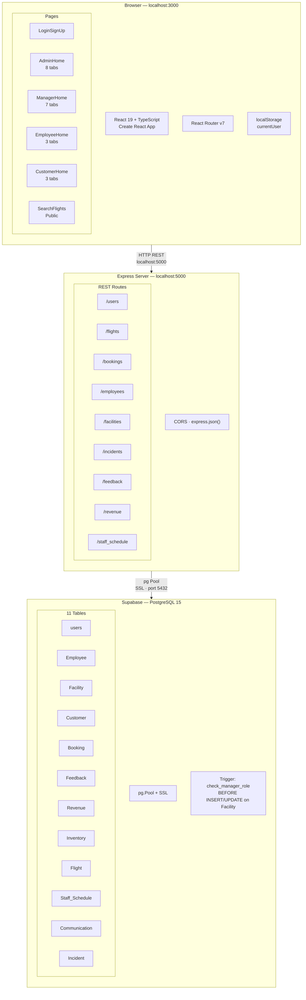
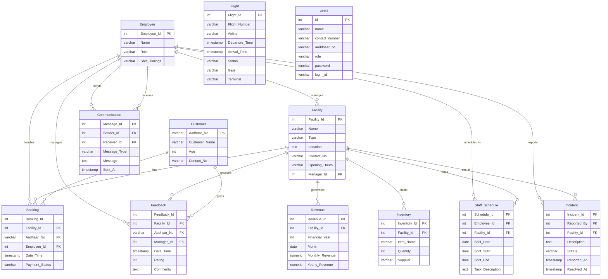
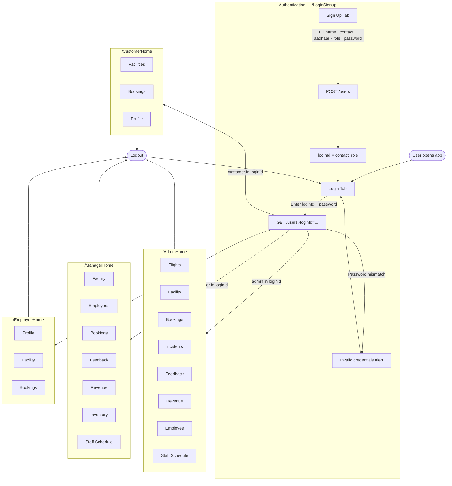
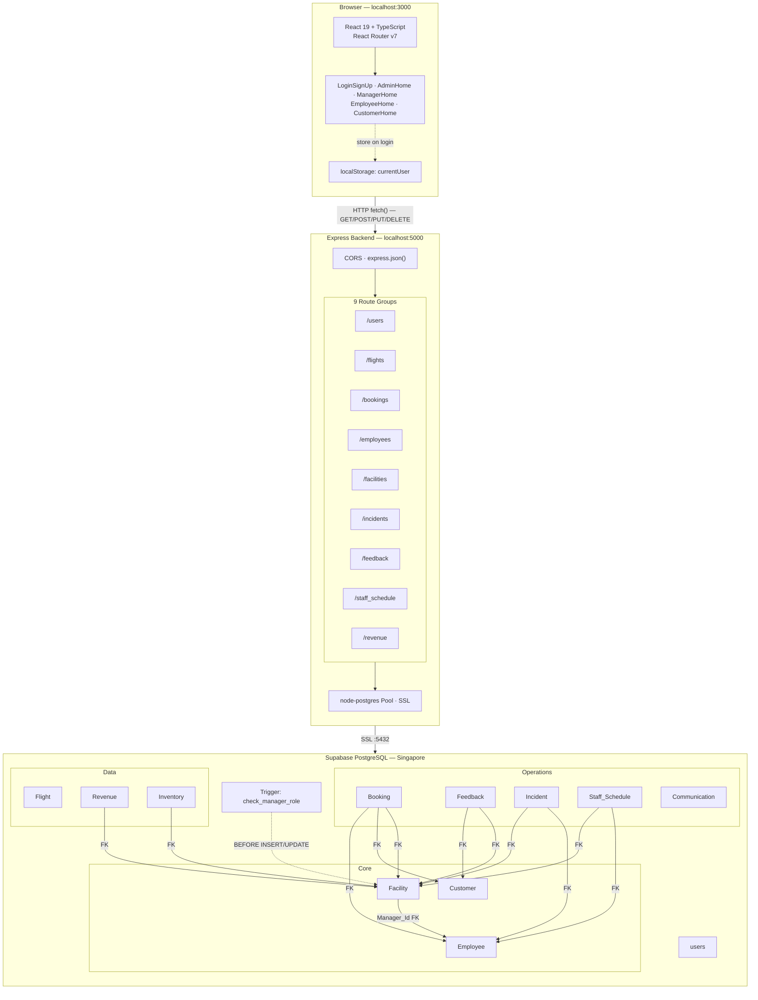

# Airport Management System (AMS)

A full-stack web application for managing airport facilities, staff, bookings, flights, revenue, incidents, and feedback. Built with TypeScript across the entire stack.

## Tech Stack

| Layer | Technology |
|---|---|
| Frontend | React 19, TypeScript, React Router v7, react-icons |
| Backend | Node.js, Express 4, TypeScript, ts-node-dev |
| Database | PostgreSQL 15 (hosted on Supabase) |
| DB Driver | node-postgres (`pg`) with SSL |

---

## User Flow

```mermaid
flowchart TD
    Start([User opens browser]) --> LP[LoginSignUp Page /]
    LP --> TabChoice{Choose tab}

    TabChoice -->|Sign Up| SU[Fill form\nname · contact · aadhaar · role · password]
    SU --> GenID["Login ID auto-generated\n{contactNumber}_{role}"]
    GenID --> PostUsers[POST /users]
    PostUsers --> ShowID[Login ID displayed to user]
    ShowID --> LP

    TabChoice -->|Login| LF[Enter Login ID + Password]
    LF --> GetUser[GET /users?loginId=...]
    GetUser --> Auth{Password matches?}
    Auth -->|No| Err[Invalid credentials]
    Err --> LF
    Auth -->|Yes| Store[Save user to localStorage]
    Store --> RoleCheck{Role in loginId?}

    RoleCheck -->|admin| AD[/AdminHome]
    RoleCheck -->|manager| MG[/ManagerHome]
    RoleCheck -->|employee| EM[/EmployeeHome]
    RoleCheck -->|customer| CU[/CustomerHome]

    AD --> ATabs["8 Tabs — Full CRUD\nFlights · Facility · Bookings · Incidents\nFeedback · Revenue · Employee · Staff Schedule"]
    MG --> MTabs["7 Tabs — View + Limited Edit\nFacility · Employees · Bookings\nFeedback · Revenue · Staff Schedule"]
    EM --> ETabs["3 Tabs — Mostly Read-Only\nProfile (edit own) · Facility · Bookings"]
    CU --> CTabs["3 Tabs\nFacilities (view) · Bookings (own CRUD) · Profile (edit own)"]

    ATabs -->|Logout| LP
    MTabs -->|Logout| LP
    ETabs -->|Logout| LP
    CTabs -->|Logout| LP
```

---

## System Architecture



---

## Database Schema — Entity Relationships



---

## Project Structure

```
DBMS_Project/
├── .env                        # DATABASE_URL (not committed)
├── backend/
│   ├── src/
│   │   ├── db.ts               # pg Pool with SSL → Supabase
│   │   ├── index.ts            # Express app (port 5000)
│   │   └── routes/
│   │       ├── users.ts
│   │       ├── flights.ts
│   │       ├── bookings.ts
│   │       ├── employees.ts
│   │       ├── facilities.ts
│   │       ├── incidents.ts
│   │       ├── feedback.ts
│   │       ├── staffSchedule.ts
│   │       └── revenue.ts
├── frontend/
│   └── src/
│       ├── App.tsx
│       ├── styles/ds.ts        # Shared inline style system + useIsMobile
│       ├── index.css           # Global utility classes
│       ├── components/
│       │   ├── LoginSignUp.tsx
│       │   ├── AdminHome.tsx
│       │   ├── ManagerHome.tsx
│       │   ├── EmployeeHome.tsx
│       │   ├── CustomerHome.tsx
│       │   ├── admin_tab/      # 8 tabs
│       │   └── customer_tab/   # 3 tabs
│       └── pages/
│           ├── Home.tsx
│           └── SearchFlights.tsx
└── database/
    ├── DDL_schema.sql
    ├── Triggers.sql
    ├── users.sql
    ├── Populate_tables.sql
    └── seed_users.sql
```

---

## Setup

### Prerequisites
- Node.js 18+
- A Supabase project (or local PostgreSQL)

### 1. Environment
Create `.env` in project root:
```env
DATABASE_URL=postgresql://postgres:<password>@db.<ref>.supabase.co:5432/postgres
PORT=5000
```

### 2. Database
Run in Supabase SQL Editor in order:
```
database/DDL_schema.sql
database/Triggers.sql
database/users.sql
database/Populate_tables.sql
database/seed_users.sql
```

### 3. Backend
```bash
cd backend && npm install && npm run dev
```

### 4. Frontend
```bash
cd frontend && npm install && npm start
```

---

## Test Credentials

| Role | Login ID | Password |
|---|---|---|
| Admin | `9000000001_admin` | `admin123` |
| Manager | `9000000002_manager` | `manager123` |
| Employee | `9000000003_employee` | `employee123` |
| Customer | `9000000004_customer` | `customer123` |

> **Note:** If on a university/college network, switch to mobile hotspot — port 5432 is commonly blocked on institutional networks.

---

## API Endpoints

Base URL: `http://localhost:5000`. All mutation params passed as URL query strings.

### `/users`
| Method | Path | Description |
|---|---|---|
| GET | `/users?loginId=` | Fetch user by login ID |
| POST | `/users` | Register new user |

### `/flights`
| Method | Path | Description |
|---|---|---|
| GET | `/flights/search` | Search by flight_number, airline, departure_date |
| POST | `/flights/create` | Create flight |
| PUT | `/flights/update` | Update flight |
| DELETE | `/flights/:flight_number` | Delete flight |

### `/bookings`
| Method | Path | Description |
|---|---|---|
| GET | `/bookings/search` | Search by booking_id, facility_id, aadhaar_no, payment_status |
| GET | `/bookings/summary` | Joined view with facility + customer + employee names |
| POST | `/bookings/create` | Create booking |
| PUT | `/bookings/update` | Admin update |
| PUT | `/bookings/status` | Update payment status only |
| DELETE | `/bookings/delete` | Delete booking |

### `/employees`
| Method | Path | Description |
|---|---|---|
| GET | `/employees/search` | Search by id, name, role, shift_timings |
| GET | `/employees/multiple-bookings` | Employees with 2+ bookings last month |
| POST | `/employees/insert` | Create employee |
| PUT | `/employees/update` | Update employee |
| DELETE | `/employees/delete` | Delete employee |

### `/facilities`
| Method | Path | Description |
|---|---|---|
| GET | `/facilities/search` | Search by id, name, type, location, manager_id |
| GET | `/facilities/top-rated` | Facilities with avg rating > 4 |
| POST | `/facilities/insert` | Create facility |
| PUT | `/facilities/update` | Update facility |
| DELETE | `/facilities/delete` | Delete facility |

### `/incidents`
| Method | Path | Description |
|---|---|---|
| GET | `/incidents/search` | Search by id, facility_id, reported_by, status |
| POST | `/incidents/insert` | Report incident |
| PUT | `/incidents/update` | Update incident |
| DELETE | `/incidents/delete` | Delete by id |
| DELETE | `/incidents/resolved` | Delete all resolved incidents |

### `/feedback`
| Method | Path | Description |
|---|---|---|
| GET | `/feedback/search` | Search by id, facility_id, aadhaar_no, manager_id, rating |
| POST | `/feedback/insert` | Submit feedback |
| PUT | `/feedback/update` | Update feedback |
| DELETE | `/feedback/delete` | Delete feedback |

### `/staff_schedule`
| Method | Path | Description |
|---|---|---|
| GET | `/staff_schedule/search` | Search by schedule_id, employee_id, facility_id, shift_date |
| GET | `/staff_schedule/schedules/today` | Today's schedules with employee + communication join |
| POST | `/staff_schedule/insert` | Create schedule |
| PUT | `/staff_schedule/update` | Update schedule |
| DELETE | `/staff_schedule/delete` | Delete schedule |

### `/revenue`
| Method | Path | Description |
|---|---|---|
| GET | `/revenue/yearly/:year` | Total revenue per facility for year |
| GET | `/revenue/average/:year` | Avg monthly revenue per facility for year |
| GET | `/revenue/calculate_avg` | Dynamic aggregation with filters |

---

## Role-Based Access

| Role | Dashboard | Capabilities |
|---|---|---|
| Admin | `/AdminHome` | Full CRUD on all 8 entities |
| Manager | `/ManagerHome` | View + limited edit on facilities, employees, bookings, feedback, revenue, schedules |
| Employee | `/EmployeeHome` | Edit own profile; read-only access to facilities and bookings |
| Customer | `/CustomerHome` | Browse facilities; full CRUD on own bookings; edit own profile |

Authentication is client-side only (localStorage). Login ID contains the role string for routing.

---

## User Flow



---

## System Architecture


